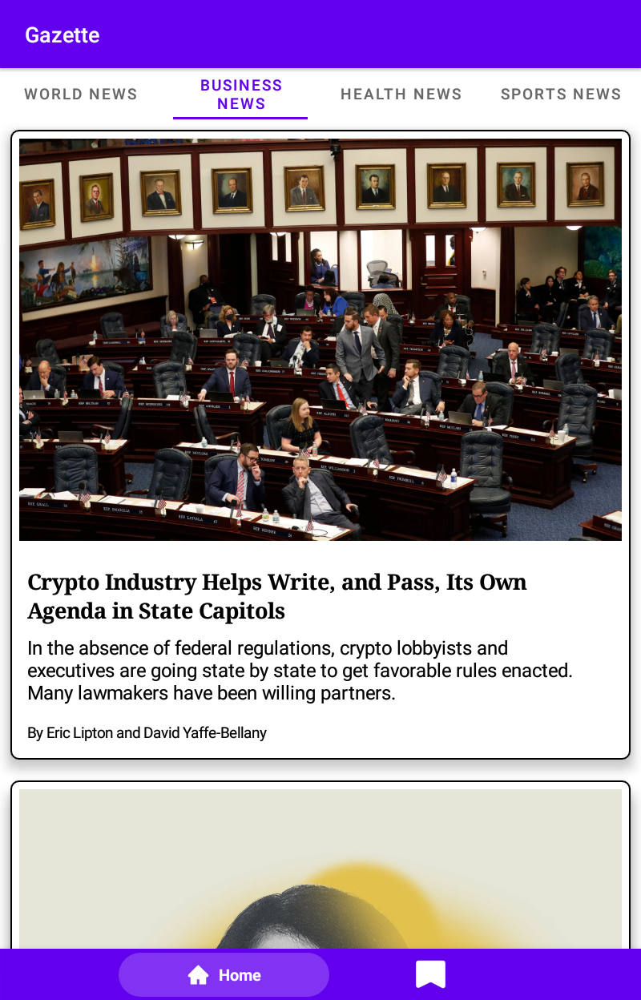
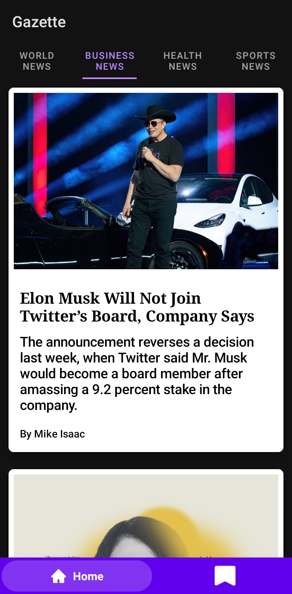
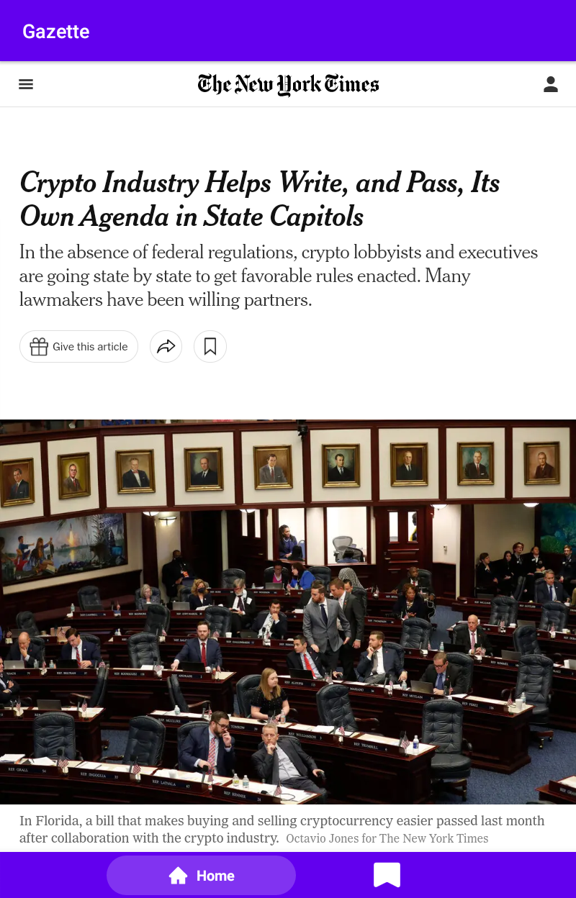
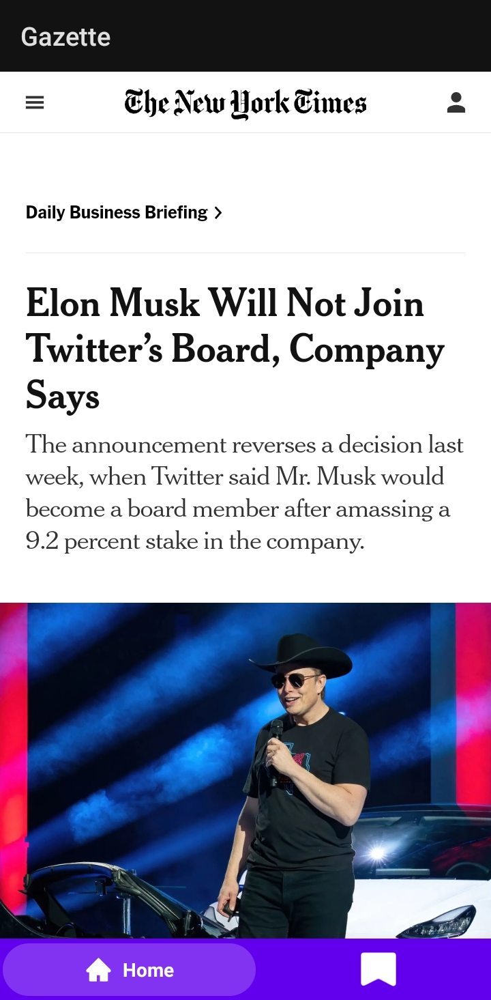

# Gazette

An Android application that fetches news from the New York Times APi and displays detail content in
a WebView.

## ScreenShots

<table>
    <tr>
        <td>Home screen Light mode</td>
        <td>Home screen Dark mode</td>
        <td>Detail screen Light mode</td>
        <td>Detail screen Dark mode</td>
    </tr>

    <tr>
        <td></td>
        <td></td>
        <td></td>
        <td></td>
    </tr>
</table>

## Architecture

The app is a single module project built with MVVM and clean architecture.

## UI

The app uses a mixture of Views and jetpack compose. Fragments host the content, the ui components
are built with both Views(ViewPager2 and TabLayout) and compose (LazyColumn).

## Navigation

Tha app uses the jetpack navigation library with fragments

## Android components used

* Views
* Composable
* ViewModel
* Compose ConstraintLayout
* Kotlin Coroutines
* Jetpack Navigation

## Libraries used

* Retrofit and OkHttp
* Kotlinx serialization
* Expandable Bottom bar

## Contribution

To make a contribution, just make a pull-request.

## To-DO

* Add Bookmarking feature with Room persistence
* Integrate xml Theming with composables.

## License

The MIT License (MIT) Copyright © 2022 Efe Egbevwie

Permission is hereby granted, free of charge, to any person obtaining a copy of this software and
associated documentation files (the “Software”), to deal in the Software without restriction,
including without limitation the rights to use, copy, modify, merge, publish, distribute,
sublicense, and/or sell copies of the Software, and to permit persons to whom the Software is
furnished to do so, subject to the following conditions:

The above copyright notice and this permission notice shall be included in all copies or substantial
portions of the Software.

THE SOFTWARE IS PROVIDED “AS IS”, WITHOUT WARRANTY OF ANY KIND, EXPRESS OR IMPLIED, INCLUDING BUT
NOT LIMITED TO THE WARRANTIES OF MERCHANTABILITY, FITNESS FOR A PARTICULAR PURPOSE AND
NONINFRINGEMENT. IN NO EVENT SHALL THE AUTHORS OR COPYRIGHT HOLDERS BE LIABLE FOR ANY CLAIM, DAMAGES
OR OTHER LIABILITY, WHETHER IN AN ACTION OF CONTRACT, TORT OR OTHERWISE, ARISING FROM, OUT OF OR IN
CONNECTION WITH THE SOFTWARE OR THE USE OR OTHER DEALINGS IN THE SOFTWARE.

 