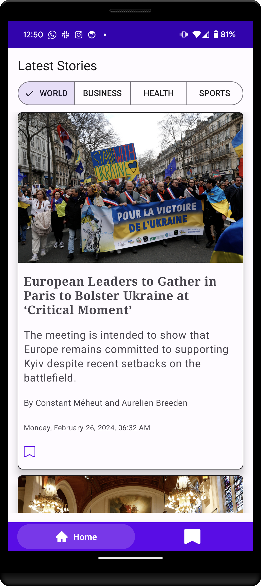

# Gazette

An Android application that fetches news from the New York Times APi and displays detail content in
a WebView.

## ScreenShots

### Phone Home screen day mode

### Phone Home screen dark mode
 

### Create collection

### Save story to collection

### Delete story from  collection

### Browse read later collections

### Browse stories in  collections

### News detail

## Architecture

This app is a single module project with a single activity and multiple fragments.
Navigation is done using the jetpack navigation library.
Fragments serve as containers for composable screen content.
Safe args is used to pass arguments between fragments.
Jetpack view model holds each screen state in the form of a MutableStateFlow. Screens observe this flow
and reacts to it's state changes, they also pass events to the view model which in turn manipulates the
app data.

## Android components used

* Views
* Jetpack Compose
* Room persistence library
* Jetpack ViewModel
* Compose ConstraintLayout
* Kotlin Coroutines
* Jetpack Navigation

## Libraries used

* Retrofit and OkHttp
* Kotlinx serialization
* Expandable Bottom bar -  https://github.com/st235/ExpandableBottomBar

## Contribution

To make a contribution, just make a pull-request.

## To-DO
* Edit read later collection titles

## License

The MIT License (MIT) Copyright © 2022 Efe Egbevwie

Permission is hereby granted, free of charge, to any person obtaining a copy of this software and
associated documentation files (the “Software”), to deal in the Software without restriction,
including without limitation the rights to use, copy, modify, merge, publish, distribute,
sublicense, and/or sell copies of the Software, and to permit persons to whom the Software is
furnished to do so, subject to the following conditions:

The above copyright notice and this permission notice shall be included in all copies or substantial
portions of the Software.

THE SOFTWARE IS PROVIDED “AS IS”, WITHOUT WARRANTY OF ANY KIND, EXPRESS OR IMPLIED, INCLUDING BUT
NOT LIMITED TO THE WARRANTIES OF MERCHANTABILITY, FITNESS FOR A PARTICULAR PURPOSE AND
NONINFRINGEMENT. IN NO EVENT SHALL THE AUTHORS OR COPYRIGHT HOLDERS BE LIABLE FOR ANY CLAIM, DAMAGES
OR OTHER LIABILITY, WHETHER IN AN ACTION OF CONTRACT, TORT OR OTHERWISE, ARISING FROM, OUT OF OR IN
CONNECTION WITH THE SOFTWARE OR THE USE OR OTHER DEALINGS IN THE SOFTWARE.

 
